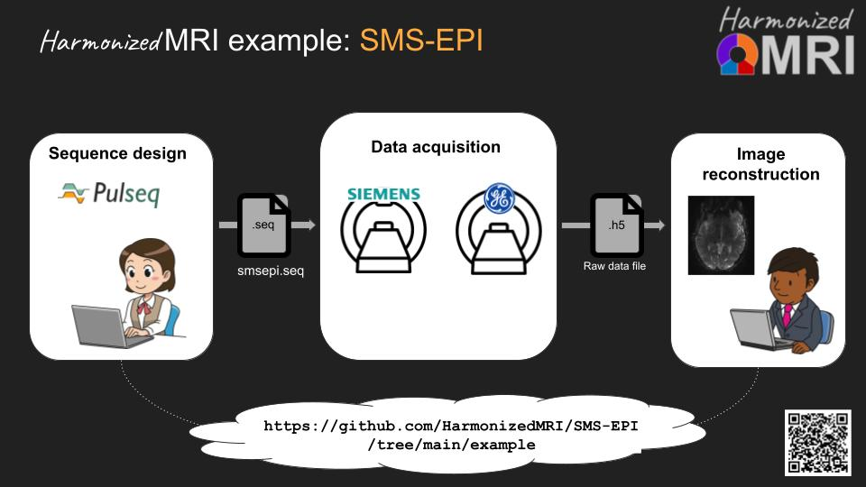

# Vendor-agnostic SMS-EPI fMRI sequence and image reconstruction

## Overview
Pooling functional MRI data from different sites and points in time 
should allow for increased statistical power, 
provided that the imaging experiment can be conducted in a known and reproducible way. 
Unfortunately, this has so far proven difficult, 
since the details of the vendor-provided fMRI acquisition and reconstruction software 
are generally not known to the researcher.

This repository contains a fully **vendor-agnostic and portable fMRI protocol**
that ensures identical sequence execution and image reconstruction across different scanners, 
and across scanner software upgrades. 
At present, Siemens and GE scanners are fully supported.
The acquisition sequence is defined in a simple (and human readable) text file in the Pulseq file format, 
and sequence execution on real hardware is made possible by sequence-agnostic interpreters that we provide:

## Getting started

1. Contact the HarmonizedMRI study team for access to the interpreter for your scanner.
2. Download the file 'smsepi.seq' and run it on your scanner.
3. Reconstruct the data using slice GRAPPA code that we provide.

## Detailed example

The ./example/ folder in this repository contains a detailed workflow 
that implements all steps needed to implement the above diagram 
(expect for scan instructions which we provide elsewhere).

## Beta testers wanted!

If you have an interest in multi-site fMRI, or just want to prototype new EPI fMRI methods,
our Pulseq SMS-EPI fMRI protocol may be for you.
If you'd like to give it a quick try for evaluation purposes, 
or are already sure you want to use it for your fMRI studies, 
send an email to jfnielse@umich.edu and we will work with you
to install the Pulseq interpreters and the sequence and reconstruction code.

