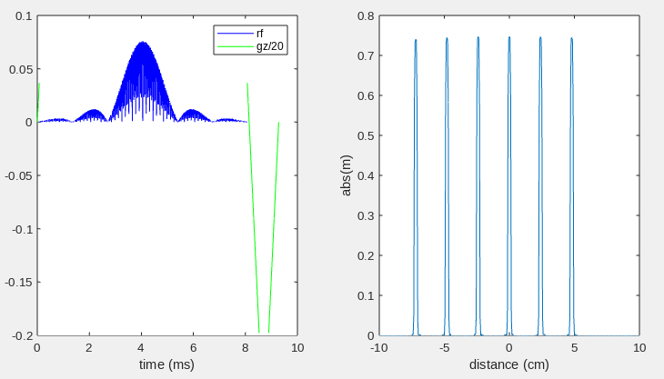

# Create Pulseq files for SMS-EPI fMRI, for Siemens and GE scanners

## Setup 

### Python setup
The CAIPIA ky-kz sampling pattern is generated using Rüdiger Stirnberg's Python code.

1. Get the code: 
Download from 
https://github.com/HarmonizedMRI/3DEPI.
For example, on the Linux command line, do:
    ```
    $ git clone git@github.com:HarmonizedMRI/3DEPI.git
    ```

2. Set up python virtual environment (recommended) and install required libraries;
    ```
    sudo apt install python3.13-venv
    python3 -m venv myvenv
    source myvenv/bin/activate
    pip install matplotlib
    pip install scipy
    ```

### MATLAB setup

See main.m

## Create the Pulseq sequence files

### Siemens users

1. In main.m, set the `scanner` variable to 'Siemens' 

2. Enter your python virtual environment at start MATLAB
   ```
   $ source myvenv/bin/activate
   $ matlab
   ```

3. Run main.m
    ```
    >> main;
    ```

You should see the following output:
```
mb=6
Frame 4 of 4
Timing check passed successfully
mb=6
Frame 2 of 2
Timing check passed successfully
mb=1
Frame 2 of 2
Timing check passed successfully
```


SMS excitation pulse Bloch simulation (SMS factor 6):


Three .seq files will have been created in the current working directory:

* **cal.seq**: EPI calibration scan
* **2d.seq**: 2D fully sampled slice-GRAPPA calibration scan
* **mb6.seq**: SMS-EPI fMRI scan (4 frames)


### GE users

Set `scanner = 'GE'` in main.m and run it.

You should see the following output:
```
mb=6
Frame 4 of 4
Timing check passed successfully
seq2ceq: Getting block 3160/3160
ceq2ge: Writing block 3160/3160
preflightcheck: Checking max 10s SAR, time interval 0-10s (scan duration: 3s)
	Predicted peak 10s SAR in 150 lbs subject: 0.2 W/kg
Sequence file mb6.tar ready for execution on GE scanners
mb=6
Frame 2 of 2
Timing check passed successfully
seq2ceq: Getting block 6320/6320
ceq2ge: Writing block 6320/6320
preflightcheck: Checking max 10s SAR, time interval 0-10s (scan duration: 6s)
	Predicted peak 10s SAR in 150 lbs subject: 0.4 W/kg
Sequence file cal.tar ready for execution on GE scanners
mb=1
Frame 2 of 2
Timing check passed successfully
seq2ceq: Getting block 9480/9480
ceq2ge: Writing block 9480/9480
preflightcheck: Checking max 10s SAR, time interval 10-20s (scan duration: 19s)
	Predicted peak 10s SAR in 150 lbs subject: 0.1 W/kg
Sequence file 2d.tar ready for execution on GE scanners
```

This will create three **.tar** archive files that corresponding to the .seq files listed above.
These sequences can be executed on GE scanners using the **tv6 v1.9.0** Pulseq interpreter, available here:
https://github.com/jfnielsen/TOPPEpsdSourceCode/releases/tag/v1.9.0.
Scan instructions are available here: https://github.com/jfnielsen/TOPPEpsdSourceCode/tree/UserGuide/v6.


## Misc development notes

.seq and .tar (TOPPE) scan files are located in 
UMich fMRI laboratory Google drive,
ENGIN-fMRI-laboratory > HarmonizedMRI project > fMRI > Protocol > sequene files > ABCD SMS-EPI

Oct 27, 2024: combine epi calibration and slice-grappa (mb=1) calibration scans into one
 ==> by simply setting 'doRefScan = true' for mb=1 scan. 
 This gives slice-by-slice ghost calibration data.

From early 2024:
Other recent changes:
  * getsmspulse.m: put first slice at -mb/2 (remove shift of +sliceSep/2)
     * writeEPI.m: accordingly, remove shift of -sliceSep/2 (rf.freqOffset)
  * set maxView = np x etl when mb>1, etl otherwise
  * Fixed slice offset for mb=1
  * etl=72 (multiple of mb=6)
  * TR=800ms
  * Add RF spoiling
  * add fat sat as default
  * Interleaved partition ordering, with last two even shots swapped
  * Remove arg.spoilersOn option (always on)
